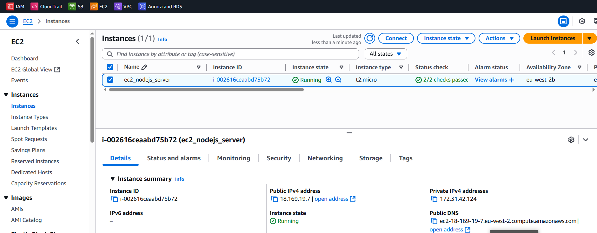
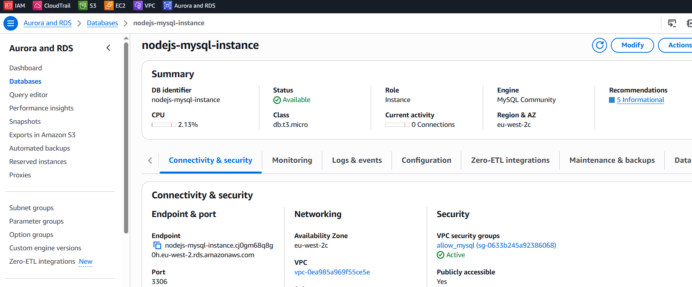
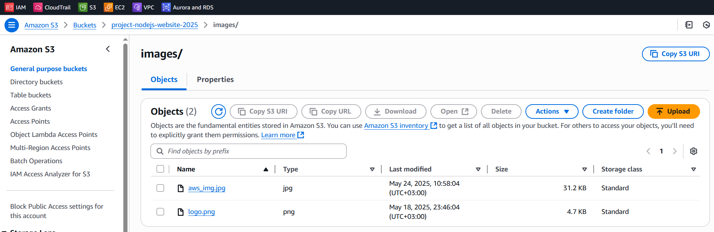
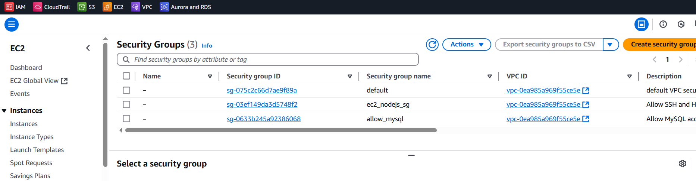

### Terraform setup for AWS Nodejs project

1. Cloned project from repo https://github.com/verma-kunal/nodejs-mysql (project to display on UI data from MySQL database, specifically users table)
2. SSH into EC2 instance `ssh -i ~/.ssh/terraform_ec2.pem ubuntu@{public_ip_address}`
3. Connect to RDS instance `mysql -h {rds_endpoint} -u {username} -p`
4. Populate db with some test data, so it's displayed on UI: 
`show databases;` -> `use nodejs_mysql_db;` -> use `nodejs-mysql/db_commands.sql` create and insert commands
5. Terraform setup: `terraform init` -> `terraform plan` -> `terraform apply` 
(to recreate instead of updating resource for e.g. `terraform taint aws_instance.tf_ec2 -> terraform apply )`; `terraform destroy` in the end

___
```
(venv) PS C:\Users\User\PycharmProjects\terraform_table_view_web_project\terraform> terraform state list
data.aws_vpc.default
aws_db_instance.tf_rds
aws_instance.tf_ec2
aws_s3_bucket.tf_s3_bucket
aws_s3_object.tf_s3_object["aws_img.jpg"]
aws_s3_object.tf_s3_object["logo.png"]
aws_security_group.tf_ec2_sg
aws_security_group.tf_rds_sg
```
---

APP UI:


DB data:


---
AWS resources

EC2 instance:


RDS MySQL db instance:


S3 bucket:


Security groups (for EC2 and RDS):
