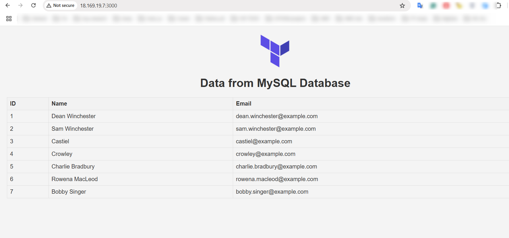
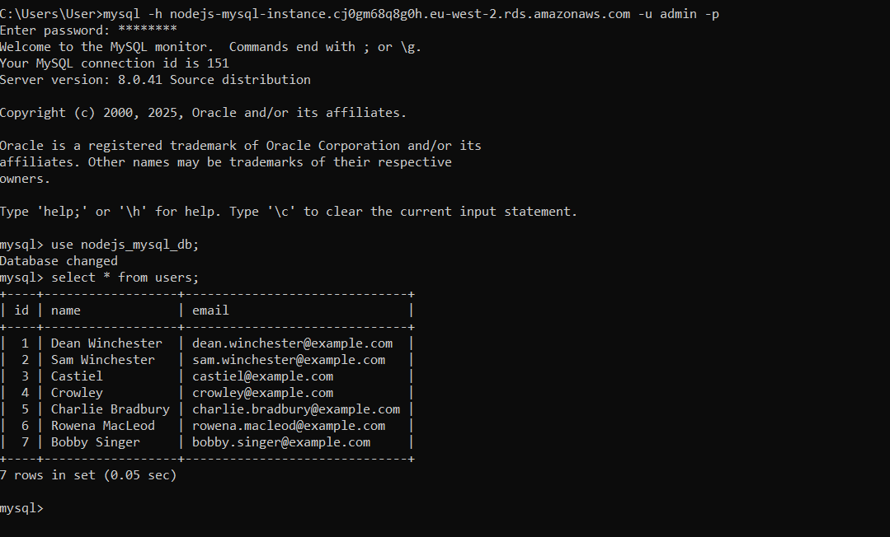

### Terraform setup for AWS Nodejs project

1. Cloned project from repo https://github.com/verma-kunal/nodejs-mysql (project to display on UI data from MySQL database, specifically users table)
2. SSH into EC2 instance `ssh -i ~/.ssh/terraform_ec2.pem ubuntu@{public_ip_address}`
3. Connect to RDS instance `mysql -h {rds_endpoint} -u {username} -p`
4. Populate db with some test data, so it's displayed on UI: 
`show databases;` -> `use nodejs_mysql_db;` -> use `nodejs-mysql/db_commands.sql` create and insert commands

APP UI:

DB data:
